# Barcode Runners Recognizer

The algorithm is trying to solve a common  problem on competition: automatical detection of each competitor using the 
barcode attached on the competition number. 

This repository contains only the initial version of the algorithm and it is able to detect barcodes in common pictures. 
If you need the full code for the entire framework, please contact me.

# Table of contents
1. [Project installation](#1-project-installation)
2. [Project description](#2-project-description)  
3. [Results](#3-results)

# 1. Project installation
[[back to the top]](#table-of-contents)

### Installation steps (tested on Ubuntu) ###

Install GIT

*sudo apt-get install git*

Get the source code
 
*mkdir barcode-runners-recognizer*

*cd barcode-runners-recognizer*

*git init*

*git clone https://github.com/imironica/barcode-runners-recognizer.git*

Install latest python packages from *requirements.txt* file

*pip3 install -r requirements.txt*

# 2. Project description 
[[back to the top]](#table-of-contents)

This case study shows how to create a classical model for detecting the barcodes from running competitions.

# 3. Results 
[[back to the top]](#table-of-contents)

Examples of correct classified examples:

Image examples with correct detected barcodes   |  Extracted barcodes
:-------------------------:|:-------------------------:
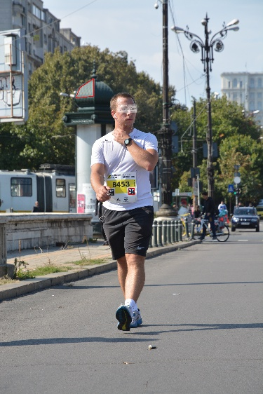 | 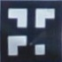 
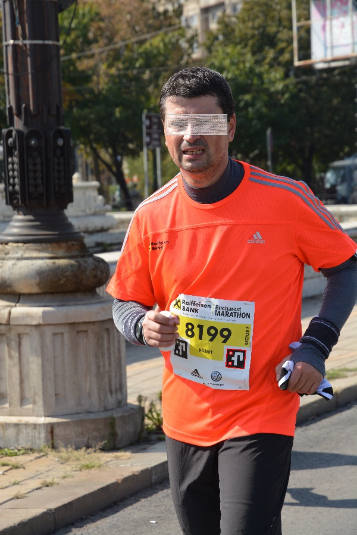 | 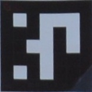 
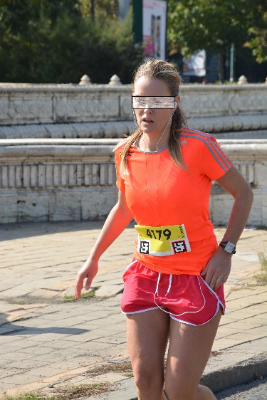 | 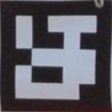 
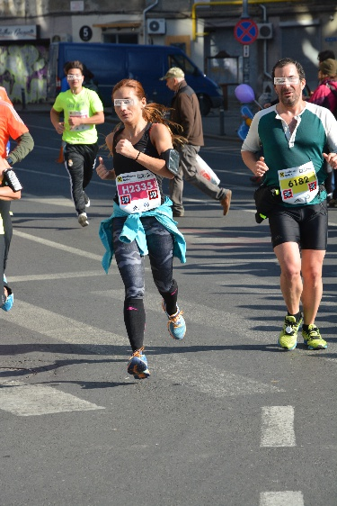 | 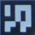  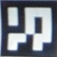  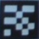 
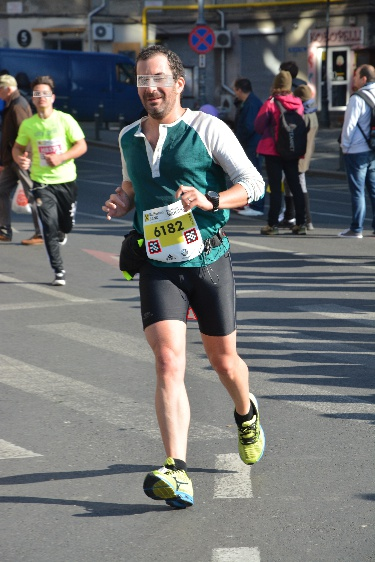 | 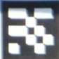 
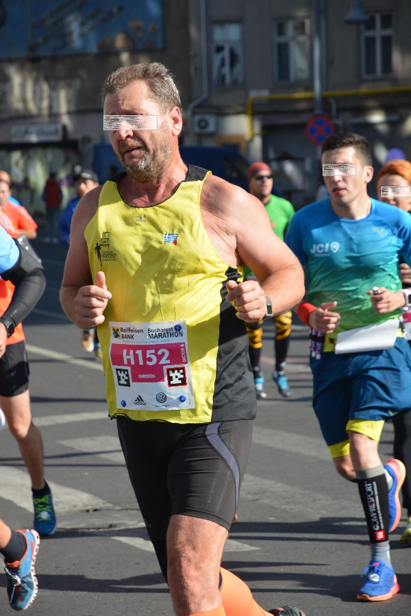 | 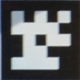 

